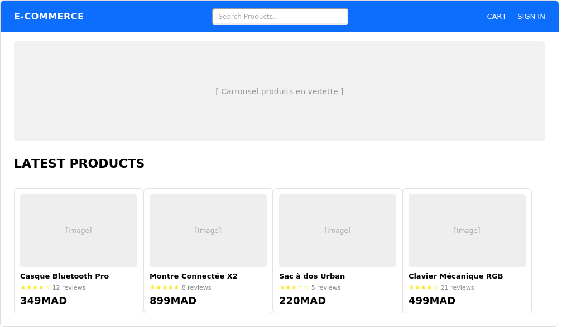
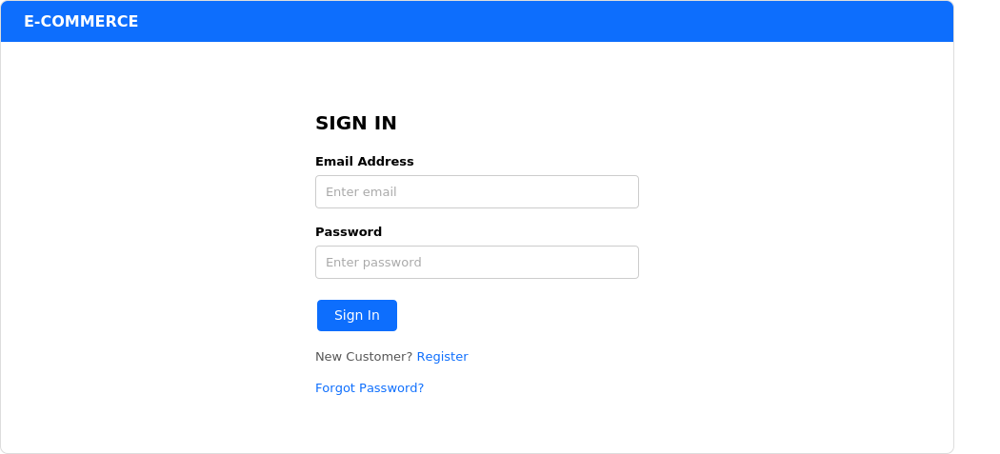
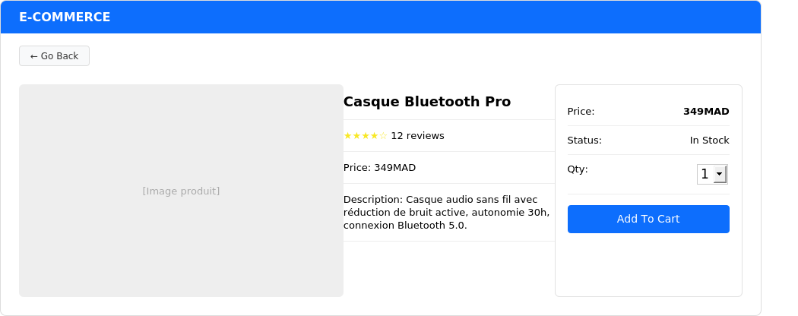
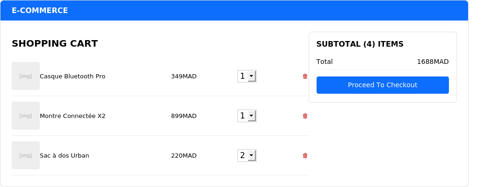
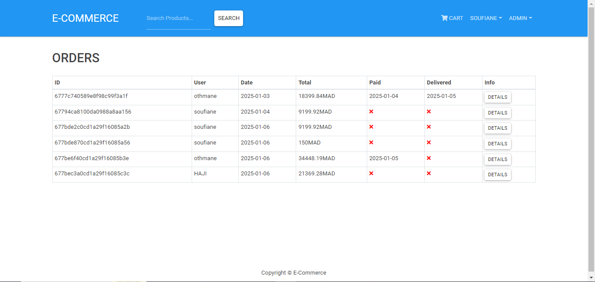
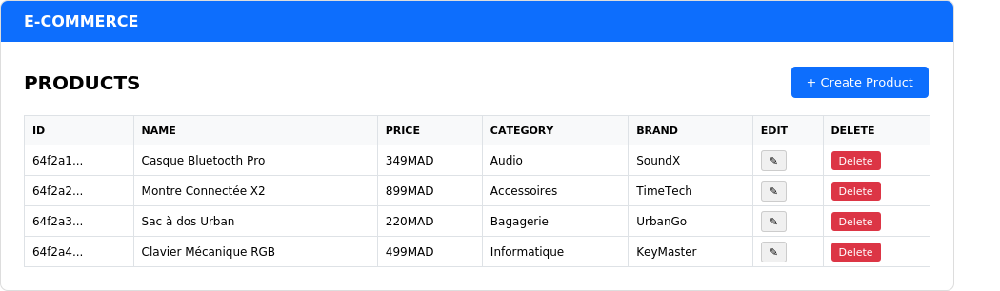

# E-Commerce — Plateforme MERN

Application e-commerce complète développée avec la stack **MERN** (MongoDB, Express, React, Node.js), incluant un système d'authentification sécurisé, un catalogue de produits avec avis, un panier, un processus de commande avec paiement PayPal, et un tableau de bord administrateur complet.

## Fonctionnalités

### Espace utilisateur
- Inscription et connexion sécurisées (JWT + mots de passe hachés avec bcrypt)
- Vérification de l'adresse email à l'inscription
- Réinitialisation de mot de passe par email avec code PIN de vérification
- Gestion du profil utilisateur (modification des informations)
- Recherche et pagination des produits
- Fiche produit détaillée avec système d'avis et de notation (reviews & rating)
- Panier d'achat avec gestion des quantités
- Tunnel de commande en plusieurs étapes (livraison → paiement → récapitulatif)
- Paiement en ligne intégré via **PayPal**
- Historique des commandes personnelles

### Espace administrateur
- Tableau de bord avec gestion des utilisateurs (liste, modification, suppression)
- Gestion des produits (ajout, modification, suppression, upload d'image)
- Gestion des commandes (liste de toutes les commandes, marquage comme livrée)
- Mise en avant des produits les mieux notés (top products)

## Stack technique

| Côté | Technologies |
|------|-------------|
| Front-end | React 17, Redux (Redux Thunk), React Router, React-Bootstrap, Axios |
| Back-end | Node.js, Express, Mongoose (MongoDB) |
| Authentification | JSON Web Token (JWT), bcrypt.js |
| Paiement | PayPal React SDK |
| Emailing | Nodemailer |
| Upload de fichiers | Multer |
| Base de données | MongoDB |

## Structure du projet

```
projet_ecommerce/
├── backend/
│   ├── config/
│   │   └── db.js                 # Connexion à MongoDB
│   ├── controllers/
│   │   ├── userController.js     # Auth, inscription, profil, reset password, vérif. email
│   │   ├── productController.js  # CRUD produits, reviews, top products
│   │   └── orderController.js    # Création et gestion des commandes
│   ├── middleware/
│   │   ├── authMiddleware.js     # Protection des routes (JWT)
│   │   └── errorMiddleware.js
│   ├── models/                   # Schémas Mongoose (User, Product, Order)
│   ├── routes/                   # Routes Express (users, products, orders, upload)
│   ├── utils/                    # Génération de token, envoi d'emails
│   └── server.js                 # Point d'entrée du serveur Express
│
├── frontend/
│   └── src/
│       ├── components/           # Header, Footer, Product, Rating, Paginate, SearchBox...
│       ├── screens/               # Home, Product, Cart, Login, Register, Profile,
│       │                          # Shipping, Payment, PlaceOrder, Order, listes admin...
│       ├── actions/                # Actions Redux
│       ├── reducers/               # Reducers Redux
│       └── store.js                # Configuration du store Redux
│
└── package.json                  # Scripts racine (dev, server, client, build)
```

## Installation

### Prérequis
- Node.js (v14+)
- MongoDB (local ou Atlas)
- Un compte développeur PayPal (pour les clés API)

### Étapes

1. Cloner le dépôt
   ```bash
   git clone https://github.com/<ton-username>/ecommerce-mern.git
   cd ecommerce-mern
   ```

2. Installer les dépendances du back-end (racine du projet)
   ```bash
   npm install
   ```

3. Installer les dépendances du front-end
   ```bash
   cd frontend
   npm install
   cd ..
   ```

4. Créer un fichier `.env` à la racine avec les variables suivantes :
   ```
   NODE_ENV=development
   PORT=5000
   MONGO_URI=<ton_uri_mongodb>
   JWT_SECRET=<ta_cle_secrete>
   PAYPAL_CLIENT_ID=<ton_client_id_paypal>
   EMAIL_USER=<ton_email>
   EMAIL_PASS=<ton_mot_de_passe_application>
   EMAIL_SERVICE=gmail
   BASE_URL=http://localhost:5000
   ```

5. Lancer le back-end et le front-end simultanément
   ```bash
   npm run dev
   ```

6. Accéder à l'application sur `http://localhost:3000`

## API — Aperçu des routes principales

| Méthode | Route | Description |
|---------|-------|-------------|
| POST | `/api/users/login` | Connexion utilisateur |
| POST | `/api/users` | Inscription |
| GET/PUT | `/api/users/profile` | Récupérer / modifier le profil |
| GET | `/api/products` | Liste des produits (recherche + pagination) |
| GET | `/api/products/:id` | Détail d'un produit |
| POST | `/api/products/:id/reviews` | Ajouter un avis |
| POST | `/api/orders` | Créer une commande |
| GET | `/api/orders/:id` | Détail d'une commande |
| PUT | `/api/orders/:id/pay` | Marquer une commande comme payée |

## Captures d'écran

| Page d'accueil | Connexion |
|---|---|
|  |  |

| Détail produit | Panier |
|---|---|
|  |  |

| Commande / Paiement | Tableau de bord admin |
|---|---|
|  |  |

## Auteur

**Soufiane EL AMRAOUI**
Étudiant en Master Intelligence Artificielle et Cybersécurité
linkdem [https://www.linkedin.com/in/soufiane-el-amraoui-92868a2a6/]
